### How Phones Are Linked & How to Perform a Global Search:

1.  **Single Key:** A field like `phone`, when marked as `unique`, is used as a global key. The system guarantees that the same phone number can only be inserted into the database **once**, regardless of the table or data source.
2.  **Sharding by Phone:** The data record for a specific phone number always lands on the same shard (database instance), because the shard is determined by the hash of that number.
3.  **Global Search:** To find **all** data associated with a single phone number, you need to:
    a. Calculate the phone number's hash to determine the correct shard.
    b. Connect to that shard's database instance.
    c. Query **all** `octagon_*` tables on that shard with `WHERE phone = '...'`.

This architecture ensures that all phone numbers are linked, and you can reliably find all associated records.

---

```mermaid
erDiagram

    uniqueness_registry {
        TEXT value PK "Unique value (e.g., phone, email)"
        TEXT location_hint "Shard pointer (table_name@shard_key)"
    }

    octagon_telegram_collection_v1 {
        BIGINT octagon_id PK
        TEXT phone "UK"
        BIGINT user_id
        TEXT username
        TEXT first_name
        TEXT last_name
        JSONB attributes
    }

    octagon_telegram_export {
        BIGINT octagon_id PK
        TEXT phone "UK, INDEX"
        BIGINT user_id "INDEX"
        TEXT username
        TEXT first_name
        TEXT last_name
        JSONB attributes
    }

    octagon_yandex_practicum {
        BIGINT octagon_id PK
        TEXT phone "UK, INDEX"
        TEXT first_name
        TEXT last_name
        TEXT email "INDEX"
        TEXT username
        BIGINT yauid
        JSONB attributes
    }

    octagon_yandex_eda {
        BIGINT octagon_id PK
        TEXT phone "UK"
        TEXT parted_name
        TEXT email
        TEXT city
        TEXT street
        TEXT house
        TEXT entrance
        TEXT first_name
        TEXT last_name
        JSONB attributes
    }

    octagon_2gis_users {
        BIGINT octagon_id PK
        TEXT phone "UK"
        TEXT first_name
        TEXT last_name
        TEXT profile_image_uri
        JSONB attributes
    }

    octagon_instagram_accounts {
        BIGINT octagon_id PK
        TEXT username "UK"
        TEXT password
        JSONB attributes
    }

    octagon_telegram_fsociety {
        BIGINT octagon_id PK
        TEXT phone "UK"
        TEXT user_id
        JSONB attributes
    }

    octagon_tinkoff_bank_russia {
        BIGINT octagon_id PK
        TEXT phone "UK"
        TEXT first_name
        TEXT last_name
        TEXT country_code
        TEXT city
        TEXT payment_method
        DOUBLE amount
        TEXT payment_purpose
        JSONB attributes
    }

    octagon_orders {
        BIGINT octagon_id PK
        TEXT phone "UK"
        TEXT first_name
        TEXT city
        TEXT street
        TEXT house
        TEXT entrance
        TEXT floor
        TEXT office
        TEXT comment
        TEXT doorcode
        DOUBLE lat
        DOUBLE lon
        BIGINT user_id
        BIGINT yauid
        JSONB attributes
    }

    octagon_yandex_orders {
        BIGINT octagon_id PK
        TEXT phone "UK"
        TEXT first_name
        TEXT city
        TEXT street
        TEXT house
        TEXT entrance
        TEXT floor
        TEXT office
        TEXT comment
        TEXT doorcode
        DOUBLE lat
        DOUBLE lon
        BIGINT user_id
        BIGINT yauid
        JSONB attributes
    }

    octagon_yandex_couriers {
        BIGINT octagon_id PK
        TEXT phone "UK"
        TEXT first_name
        TEXT last_name
        JSONB attributes
    }

    uniqueness_registry }o--|| octagon_telegram_collection_v1 : "Ensures uniqueness"
    uniqueness_registry }o--|| octagon_telegram_export : "Ensures uniqueness"
    uniqueness_registry }o--|| octagon_yandex_practicum : "Ensures uniqueness"
    uniqueness_registry }o--|| octagon_yandex_eda : "Ensures uniqueness"
    uniqueness_registry }o--|| octagon_2gis_users : "Ensures uniqueness"
    uniqueness_registry }o--|| octagon_instagram_accounts : "Ensures uniqueness"
    uniqueness_registry }o--|| octagon_telegram_fsociety : "Ensures uniqueness"
    uniqueness_registry }o--|| octagon_tinkoff_bank_russia : "Ensures uniqueness"
    uniqueness_registry }o--|| octagon_orders : "Ensures uniqueness"
    uniqueness_registry }o--|| octagon_yandex_orders : "Ensures uniqueness"
    uniqueness_registry }o--|| octagon_yandex_couriers : "Ensures uniqueness"

```

